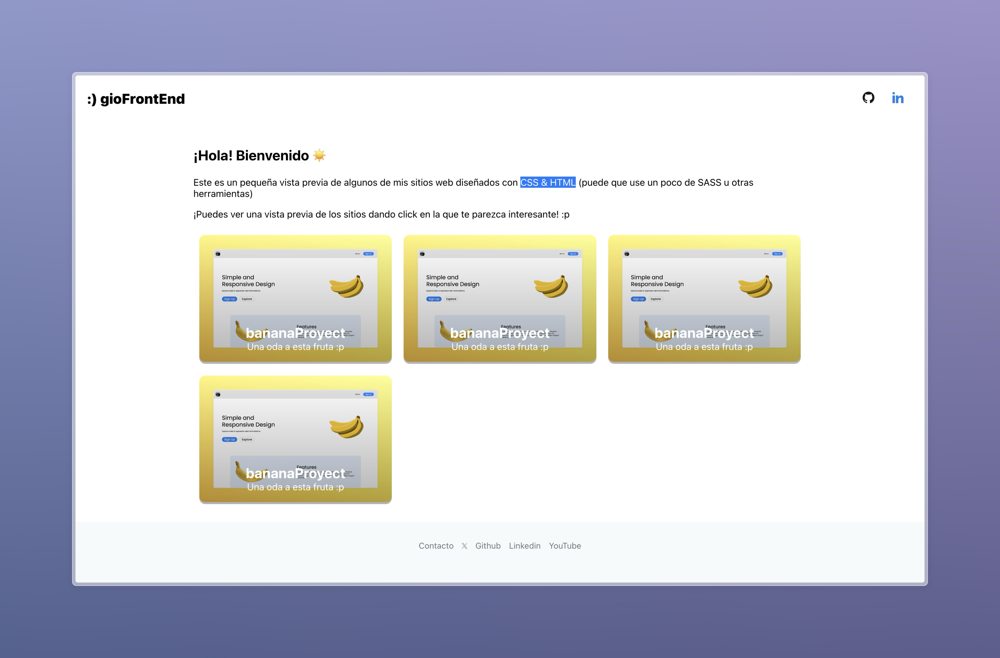

# gioFrontEnd



## Descripción
Este repositorio contiene el código fuente de multiples proyectos de FrontEnd.

## Instalación
Instrucciones para instalar tu proyecto.

```bash
# Clonar el repositorio
git clone https://github.com/tu_usuario/tu_proyecto.git

# Entrar al directorio del proyecto
cd tu_proyecto

# Instalar dependencias
npm install
```