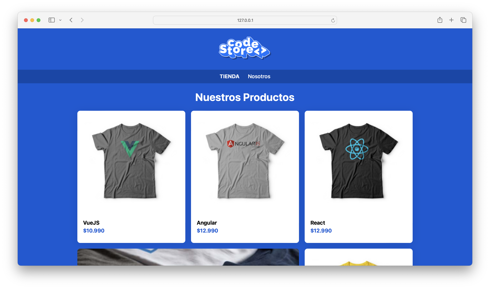

# CodeStore 🙇🏻

Este proyecto es una Prueba de Concepto para CodeStore, una tienda en línea dedicada a la venta de productos relacionados con el desarrollo de software, específicamente frameworks y herramientas para el desarrollo web.

## Demo 🏄🏻‍♂️

La demostración del proyecto aún no está disponible en línea. Se actualizará este apartado cuando se publique la demo.

## Imagen del Proyecto 🧑🏻‍🎨



## Características 👷🏻‍♂️

- **Navegación simplificada:** A través de una barra de navegación intuitiva que permite a los usuarios moverse fácilmente entre la tienda y la sección "Nosotros".
- **Catálogo de productos:** Presentación de productos con imágenes, nombres y precios claros.
- **Diseño responsivo:** Asegura una experiencia de usuario óptima en dispositivos móviles y de escritorio.

## Tecnologías Utilizadas 👨🏻‍💻

- HTML5
- CSS3
  - Normalize.css para resetear/normalizar los estilos por defecto del navegador.
  - Estilos personalizados para definir la apariencia del sitio.

## Instalación 🧍🏻

Para clonar y ejecutar este proyecto localmente, necesitarás seguir estos pasos:

1. Clona el repositorio en tu máquina local:

```bash
git clone URL_DEL_REPOSITORIO