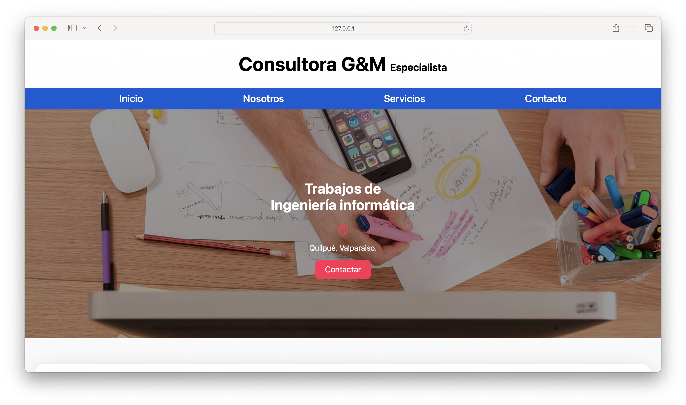

# Consultora G&M Website 🤵🏻‍♂️

Este proyecto es el sitio web de la Consultora G&M, una empresa especializada en servicios de ingeniería informática. El sitio ofrece información sobre la empresa, los servicios que ofrece, y cómo los clientes pueden ponerse en contacto.

## Vista Previa 🧍🏻

[Probar demo aquí](https://gioahumada.github.io/consultora-myg/)

## Características 👨🏻‍💻

- **Diseño Responsivo:** El sitio está diseñado para ser visualizado en cualquier dispositivo, desde teléfonos móviles hasta pantallas de escritorio grandes.
- **Navegación Intuitiva:** Con una barra de navegación sencilla y accesible, los usuarios pueden fácilmente encontrar la información que buscan.
- **Secciones de Servicios:** Detalles sobre los servicios ofrecidos por Consultora G&M, incluyendo diseño web, aplicaciones web y soluciones eCommerce.
- **Formulario de Contacto:** Un formulario fácil de usar para que los visitantes puedan enviar mensajes directamente a la empresa.

## Tecnologías Utilizadas 👷🏻‍♂️

- HTML5
- CSS3
  - Normalize.css para resetear/normalizar los estilos por defecto del navegador.
  - Estilos personalizados para darle la identidad visual al sitio.

## Estructura del Proyecto 🏄🏻‍♂️

El proyecto está estructurado de la siguiente manera:

- `index.html`: El archivo principal que contiene la estructura del sitio web.
- `css/`
  - `normalize.css`: Reset/Normalización de estilos.
  - `estilos.css`: Archivo de estilos personalizados para el sitio.
- `img/`
  - `favicon.png`: Icono del sitio.

## Licencia

Este proyecto está bajo la Licencia MIT.
